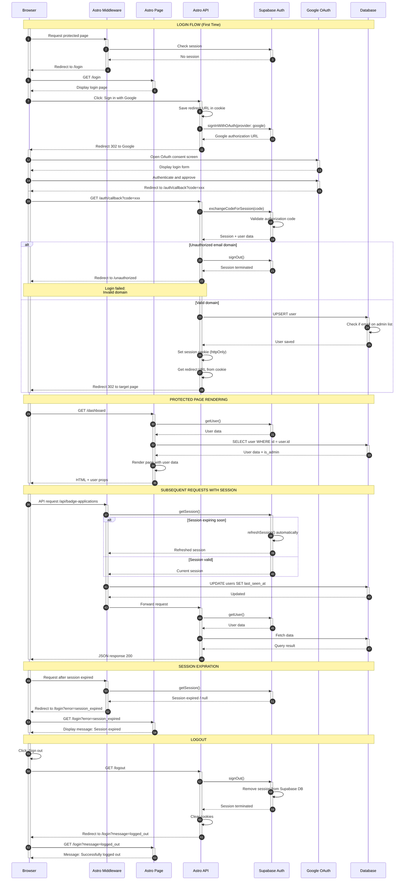

# Authentication Architecture Diagram

## Overview

This diagram presents the complete authentication flow in the 10xbadger application, utilizing Google Workspace SSO through Supabase Auth and Astro.

## Main Flows

1. **Login (First Time)** - Complete OAuth flow with Google, domain validation, user creation
2. **Protected Page Rendering** - Fetching user data and rendering with authentication context
3. **Subsequent Requests with Session** - Session validation, automatic token refresh
4. **Session Expiration** - Expired session detection and redirect to login
5. **Logout** - Session termination and cookie cleanup

## Actors

- **Browser** - Client application (React + Astro)
- **Astro Middleware** - Intermediate layer checking session
- **Astro Page** - Server-side rendered pages
- **Astro API** - Authentication endpoints
- **Supabase Auth** - Session management and OAuth
- **Google OAuth** - External identity provider
- **Database** - PostgreSQL (Supabase)

## Sequence Diagram

## Key Security Mechanisms

1. **Domain Validation** - Email verification before session creation
2. **httpOnly Cookies** - Session token inaccessible to JavaScript
3. **Automatic Refresh** - Token refreshed before expiration
4. **Middleware** - Every request validates session
5. **CSRF Protection** - State parameter in OAuth (managed by Supabase)

## Authentication Endpoints

- `GET /api/auth/google` - OAuth flow initiation
- `GET /api/auth/callback` - Google callback handler
- `GET /logout` - Session termination
- `GET /api/auth/session` - Session information retrieval
- `GET /api/me` - User profile retrieval

## References

- **PRD**: `/.ai/prd.md` - Product requirements (FR-001, US-001)
- **Auth Specification**: `/.ai/auth-spec.md` - Detailed authentication architecture
- **DB Migration**: `/supabase/migrations/20251019090000_create_initial_schema.sql` - Database schema

---

**Last Updated**: 2025-11-10  
**Status**: Technical Specification

